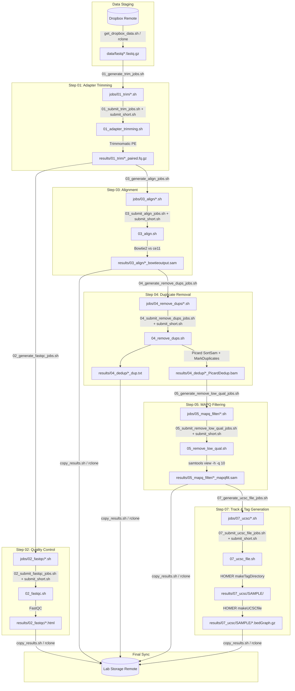

# CUT&RUN Analysis Pipeline

A high-throughput batch processing pipeline for Cleavage Under Targets and Release Using Nuclease (**CUT&RUN**) paired-end sequencing data, engineered for the **UMass Chan Medical School High-Performance Computing cluster (GHPCC / LSF)**.

---

## 1. Overview & Scientific Context

CUT&RUN (Cleavage Under Targets and Release Using Nuclease) is an epigenomic profiling technique that targets chromatin-associated proteins or histone modifications *in situ* using antibody-guided micrococcal nuclease (pAG-MNase) cleavage. Compared to traditional ChIP-seq, CUT&RUN yields high-resolution binding profiles with lower background noise and significantly reduced sequencing depth requirements.

This repository provides an automated, modular, shell-based batch pipeline tailored for the LSF scheduler (`bsub`) at UMass Chan. It covers the full lifecycle of CUT&RUN data analysis:
- Remote raw data staging from Dropbox via `rclone`
- Adapter and quality trimming via Trimmomatic
- Quality control via FastQC
- High-sensitivity paired-end read alignment via Bowtie2
- PCR duplicate identification and removal via Picard Tools
- Read filtering by mapping quality (MAPQ) and fragment size constraints
- Tag directory and genome browser track generation via HOMER
- Upstream/downstream cloud backup of deliverables

The pipeline currently targets the ***Caenorhabditis elegans*** reference genome (`ce11_ws245`), adapted from earlier human (`hg38`) and *Drosophila melanogaster* spike-in (`dm6`) protocols established within the Fazzio and Walker laboratories.

---

## 2. Pipeline Architecture & Workflow DAG



---

## 3. Directory Layout

```
.
├── 01_adapter_trimming.sh          # Worker: Runs Trimmomatic on paired reads
├── 01_generate_trim_jobs.sh        # Generator: Builds LSF job scripts for Step 01
├── 01_submit_trim_jobs.sh          # Batch Submitter: Enqueues Step 01 jobs via bsub
├── 02_fastqc.sh                    # Worker: Runs FastQC on trimmed pairs
├── 02_generate_fastqc_jobs.sh      # Generator: Builds LSF job scripts for Step 02
├── 02_submit_fastqc_jobs.sh        # Batch Submitter: Enqueues Step 02 jobs via bsub
├── 03_align.sh                     # Worker: Bowtie2 alignment against reference genome
├── 03_generate_align_jobs.sh       # Generator: Builds LSF job scripts for Step 03
├── 03_submit_align_jobs.sh         # Batch Submitter: Enqueues Step 03 jobs via bsub
├── 04_remove_dups.sh               # Worker: Picard SortSam and MarkDuplicates
├── 04_generate_remove_dups_jobs.sh # Generator: Builds LSF job scripts for Step 04
├── 04_submit_remove_dups_jobs.sh   # Batch Submitter: Enqueues Step 04 jobs via bsub
├── 05_remove_low_qual.sh           # Worker: MAPQ >= 10 filtering using samtools
├── 05_generate_remove_low_qual_jobs.sh # Generator: Builds LSF job scripts for Step 05
├── 05_submit_remove_low_qual_jobs.sh   # Batch Submitter: Enqueues Step 05 jobs via bsub
├── 07_ucsc_file.sh                 # Worker: HOMER makeTagDirectory & makeUCSCfile
├── 07_generate_ucsc_file_jobs.sh   # Generator: Builds LSF job scripts for Step 07
├── 07_submit_ucsc_file_jobs.sh     # Batch Submitter: Enqueues Step 07 jobs via bsub
├── 08_bigwig.sh                    # Worker: Converts UCSC bedGraph to BigWig (.bw) track
├── 08_generate_bigwig_jobs.sh      # Generator: Builds LSF job scripts for Step 08
├── 08_submit_bigwig_jobs.sh        # Batch Submitter: Enqueues Step 08 jobs via bsub
├── copy_results.sh                 # Syncs reports, SAMs, metrics, bedGraphs, and BigWigs to remote
├── get_dropbox_data.sh             # Pulls FASTQ directories from remote Dropbox using rclone
├── submit_short.sh                 # Central LSF bsub execution wrapper
├── CUT_RUN_analysis_pipeline.pdf   # Protocol specification document by Evan Hass
├── .gitignore                      # Ignores data/, jobs/, results/, .ipynb_checkpoints/
└── README.md                       # Documentation & Pipeline Specification
```

---

## 4. Pipeline Stages & Detailed Technical Breakdown

### Step 00: Data Retrieval (`get_dropbox_data.sh`)
- **Utility**: `rclone`
- **Source Remote**: `remote:<data_remote>` (defaults to `remote:arjamand`)
- **Target Local**: `./data/fastq/` (or user-specified destination)
- **Functionality**: Queries remote subdirectories using `rclone lsf`, checks for `.fastq.gz` or `.fq.gz` files, and copies matching runs while logging transfer duration. Also stages root-level FASTQ files if present.

### Step 01: Adapter & Quality Trimming (`01_adapter_trimming.sh`)
- **Tool**: Trimmomatic v0.39 (`trimmomatic.jar`)
- **Adapters**: `TruSeq3-PE-2.fa`
- **Input**: Paired-end raw FASTQs (`*_R1_*.f*q.gz` and `*_R2_*.f*q.gz`)
- **Output Directory**: `./results/01_trim/`
- **Outputs**:
  - `${BASE_R1}_paired.fq.gz`, `${BASE_R1}_unpaired.fq.gz`
  - `${BASE_R2}_paired.fq.gz`, `${BASE_R2}_unpaired.fq.gz`
- **Parameters**:
  - `ILLUMINACLIP:TruSeq3-PE-2.fa:2:25:7:1:true` (seed mismatches: 2, palindrome clip threshold: 25, simple clip threshold: 7, minAdapterLength: 1, keepBothReads: true)
  - `SLIDINGWINDOW:4:10` (window size 4, required average Phred quality >= 10)
  - `TRAILING:3` (trim low-quality bases < 3 at ends)
  - `MINLEN:10` (discard reads shorter than 10 bp)

### Step 02: Quality Control (`02_fastqc.sh`)
- **Tool**: FastQC v0.11.9 (`module load fastqc/0.11.9`)
- **Input**: Trimmomatic paired-end outputs from `results/01_trim/`
- **Output Directory**: `./results/02_fastqc/`
- **Outputs**: HTML quality reports and ZIP summaries for each mate.

### Step 03: Reference Alignment (`03_align.sh`)
- **Tool**: Bowtie2 v2.5.0 (`module load bowtie2/2.5.0`, `samtools/1.16.1`)
- **Reference Index**: `/share/data/umw_biocore/genome_data/c_elegans/ce11_ws245/ce11_ws245`
- **Input**: Paired trimmed reads (`*_R1_*_paired.fq.gz`, `*_R2_*_paired.fq.gz`)
- **Output**: `./results/03_align/${SAMPLE}_bowtieoutput.sam`
- **Bowtie2 Options**:
  - `-q`: Input reads are FASTQ format
  - `--very-sensitive`: Preset for maximum accuracy and sensitivity
  - `-N 0`: Number of mismatches in seed alignment
  - `-X 500`: Maximum fragment length (insert size) set to 500 bp (captures nucleosomal and sub-nucleosomal fragments)
  - `-p 16`: 16 threads requested

### Step 04: Duplicate Sorting & Marking (`04_remove_dups.sh`)
- **Tool**: Picard Tools v2.5.0 (`SortSam`, `MarkDuplicates`)
- **Input**: Alignment SAM file from `results/03_align/`
- **Output Directory**: `./results/04_dedup/`
- **Outputs**:
  - Coordinate-sorted BAM: `${SAMPLE}_PicardSort.bam`
  - Deduplicated BAM: `${SAMPLE}_PicardDedup.bam`
  - Metrics file: `${SAMPLE}_dup.txt`
- **Parameters**:
  - `VALIDATION_STRINGENCY=LENIENT`
  - `TMP_DIR=/tmp`
  - `SORT_ORDER=coordinate`
  - `REMOVE_DUPLICATES=true` (removes optical and PCR duplicates from the output BAM)

### Step 05: MAPQ Quality Filtering (`05_remove_low_qual.sh`)
- **Tool**: Samtools v1.16.1 (`module load samtools/1.16.1`)
- **Input**: Deduplicated BAM from `results/04_dedup/`
- **Output Directory**: `./results/05_mapq_filter/`
- **Output**: `${SAMPLE}_PicardDedup_mapqfilt.sam`
- **Parameters**: `samtools view -h -q 10` (preserves SAM header, filters alignments with Mapping Quality < 10, eliminating non-unique and low-confidence alignments).

### Optional Protocol Step 06: Fragment Size Filtering (< 120 bp)
*Note: Described in the reference pipeline documentation (`CUT_RUN_analysis_pipeline.pdf`) for transcription factors.*
- Filters fragments $\le 120$ bp via `awk ' $9 <= 120 && $9 >= 1 || $9 >= -120 && $9 <= -1 '` to enrich for sub-nucleosomal transcription factor footprints over nucleosomal fragments ($\sim 150$ bp).
- Bypassed in this version for broad histone marks or total fragment profiling.

### Step 07: HOMER Tag Directory & UCSC Track Generation (`07_ucsc_file.sh`)
- **Tool**: HOMER v4.11 (`homer_env/4.11`, `makeTagDirectory`, `makeUCSCfile`)
- **Input**: Filtered SAM file from `results/05_mapq_filter/`
- **Output Directory**: `./results/07_ucsc/${SAMPLE}/`
- **Outputs**:
  - Tag directory containing per-chromosome read counts, fragmentation statistics, and run logs
  - Normalized UCSC bedGraph track: `${SAMPLE}/*.bedGraph.gz` (`-o auto`)

### Step 08: BigWig Track Generation (`08_bigwig.sh`)
- **Worker**: `08_bigwig.sh`
- **Job Generator**: `08_generate_bigwig_jobs.sh`
- **Batch Submitter**: `08_submit_bigwig_jobs.sh`
- **Module**: `ucsc_utilities/20240312` (`bedGraphToBigWig`)
- **Inputs**: HOMER-generated `${SAMPLE}.ucsc.bedGraph.gz` from `./results/07_ucsc/${SAMPLE}/`
- **Output Directory**: `./results/08_bigwig/`
- **Outputs**: Binary indexed BigWig tracks (`${SAMPLE}.bw`) for genome browser visualization

### Synchronization (`copy_results.sh`)
- Copies pipeline outputs to remote lab storage:
  - Overview PDF
  - FastQC HTML reports
  - Bowtie2 SAM alignments
  - Picard duplication metrics (`*.txt`)
  - MAPQ-filtered SAM files
  - Gzipped bedGraph tracks (`**/*.bedGraph.gz`)
  - Indexed BigWig tracks (`*.bw`)

---

## 5. HPC Job Generation & Batch Execution Pattern

Jobs are executed asynchronously on the UMass Chan GHPCC cluster managed by IBM Platform LSF (`bsub`).

Every stage follows a unified three-tier pattern:
1. **Worker Script (`NN_<action>.sh`)**: Performs the atomic scientific computing task for one sample/pair.
2. **Job Generator (`NN_generate_<action>_jobs.sh`)**: Discovers inputs, dynamically builds individualized bash job scripts in `jobs/NN_<action>/job_<sample>.sh`, and marks them executable.
3. **Submitter (`NN_submit_<action>_jobs.sh`)**: Loops through `jobs/NN_<action>/*.sh` and invokes `submit_short.sh`.

### LSF Submission Configuration (`submit_short.sh`)
```bash
bsub -q short \
     -W 6:00 \
     -n 4 \
     -R "rusage[mem=16GB]" \
     -o "${SCRIPT}.out.%J" \
     -e "${SCRIPT}.err.%J" \
     ./$SCRIPT
```
- **Queue**: `short` (maximum walltime 6:00 hours)
- **Cores**: 4 slots requested (`-n 4`)
- **Memory**: 16 GB resident memory reserved (`rusage[mem=16GB]`)
- **Logs**: Captures stdout and stderr per job ID (`%J`) alongside the job script.

---

## 6. Code Review & Architectural Critique

### Strengths & Positive Design Patterns
- **Defensive Path Validation**: Worker scripts (e.g., `01_adapter_trimming.sh`, `03_align.sh`) implement explicit validation routines verifying the existence of input files and binary paths before spawning resource-heavy processes.
- **Strict Error Handling**: Scripts enforce `set -e`, immediately halting execution if any command exits with a non-zero status.
- **Traceable Job Artifacts**: Generating concrete `.sh` scripts under `jobs/` creates reproducible audit records and allows single-sample debugging without rerunning generator loops.
- **LSF Log Segregation**: Using `%J` output and error redirects isolates cluster diagnostics for every individual submission.

---

### Critical Issues & Technical Debt

#### 1. Severe CPU Oversubscription in Alignment (`03_align.sh` vs `submit_short.sh`)
- **Issue**: `submit_short.sh` requests **4 cores** (`-n 4`) from the LSF scheduler, but `03_align.sh` specifies **16 threads** (`bowtie2 -p 16`).
- **Impact**: LSF pins the job to 4 physical cores or shares the host with other tenants. Running 16 Bowtie2 threads on 4 allocated cores triggers massive context switching overhead, CPU cache invalidation, and severe node slowdowns.
- **Resolution**: Align Bowtie2 thread count to the LSF allocation via an environment variable:
  ```bash
  THREADS="${LSB_DJOB_NUMPROC:-4}"
  bowtie2 -p "$THREADS" ...
  ```

#### 2. Excessive Disk Quota Consumption from Uncompressed SAM Files
- **Issue**: `03_align.sh` outputs raw text SAM files (`${SAMPLE}_bowtieoutput.sam`). `04_remove_dups.sh` sorts this to BAM, and `05_remove_low_qual.sh` converts it back to an uncompressed SAM file (`*_mapqfilt.sam`).
- **Impact**: CUT&RUN SAM files frequently exceed 10–30 GB per sample. Storing multiple duplicate uncompressed SAM files across `03_align`, `04_dedup`, and `05_mapq_filter` exhausts HPC project quotas.
- **Resolution**: Stream Bowtie2 output directly into coordinate-sorted BAM via `samtools sort`:
  ```bash
  bowtie2 ... | samtools sort -@ "$THREADS" -o "${RESULTS_DIR}/${SAMPLE}.sorted.bam"
  ```
  Pass compressed BAMs through `05_remove_low_qual.sh` and output indexed BAM (`samtools view -b -q 10 ...`). HOMER's `makeTagDirectory` natively accepts BAM files directly.

#### 3. Hardcoded Cluster Environment & User Paths
- **Issue**: Several scripts contain hardcoded, non-portable file paths tied to specific lab shares or personal home directories:
  - `01_adapter_trimming.sh`: `/pi/thomas.fazzio-umw/conda/pkgs/trimmomatic-0.39-hdfd78af_2/...`
  - `03_align.sh`: `/share/data/umw_biocore/genome_data/c_elegans/ce11_ws245/ce11_ws245`
  - `04_remove_dups.sh`: `/pi/thomas.fazzio-umw/Sarah/picard-tools-2.5.0/picard.jar`
  - `07_ucsc_file.sh`: `export PATH=~/software/homer/bin:$PATH`
- **Impact**: Permissions errors for non-Fazzio group members, failure when paths change or packages are updated, and broken reproducibility.
- **Resolution**: Centralize environment configurations into a single `config.env` file or use cluster environment modules (`module load trimmomatic`, `module load picard`).

#### 4. Fragile IFS Manipulation in `get_dropbox_data.sh`
- **Issue**: `get_dropbox_data.sh` manipulates `IFS="/"`, runs `rclone lsf ... | tr -d '\n'`, and splits directory listings.
- **Impact**: If folder names contain spaces, underscores, or unconventional characters, word splitting fails and corrupts directory names.
- **Resolution**: Read directly line-by-line using a `while read -r dir; do ... done < <(rclone lsf --dirs-only ...)` construct.

#### 5. Empty File: `08_bigwig.sh`
- **Issue**: `08_bigwig.sh` is a 0-byte file without code or execution generator.
- **Resolution**: Implement conversion using `bedGraphToBigWig` or `deepTools bamCoverage` (see implementation below).

#### 6. Temporary Directory Contention in Picard (`04_remove_dups.sh`)
- **Issue**: `TMP_DIR="/tmp"` uses the cluster node's local `/tmp` disk.
- **Impact**: On shared cluster nodes with multiple concurrent Picard jobs, `/tmp` can run out of space, crashing the node or killing jobs.
- **Resolution**: Set `TMP_DIR` to a scratch directory or the sample output directory: `TMP_DIR="${RESULTS_DIR}/tmp_${SAMPLE}"`.

---

## 7. Recommended Drop-in Fixes & Enhancements

### Central Configuration: `config.env`
Create a centralized environment configuration file to replace hardcoded values:

```bash
# config.env
export GENOME_INDEX="/share/data/umw_biocore/genome_data/c_elegans/ce11_ws245/ce11_ws245"
export CHROM_SIZES="/share/data/umw_biocore/genome_data/c_elegans/ce11_ws245/ce11_ws245.chrom.sizes"
export PICARD_JAR="/pi/thomas.fazzio-umw/Sarah/picard-tools-2.5.0/picard.jar"
export TRIMMOMATIC_DIR="/pi/thomas.fazzio-umw/conda/pkgs/trimmomatic-0.39-hdfd78af_2/share/trimmomatic-0.39-2"
export ADAPTERS="$TRIMMOMATIC_DIR/adapters/TruSeq3-PE-2.fa"
export LSF_DEFAULT_CORES=4
export LSF_DEFAULT_MEM="16GB"
export LSF_QUEUE="short"
export LSF_WALLTIME="6:00"
```

### Complete Implementation for `08_bigwig.sh`
Below is the drop-in implementation for BigWig track conversion using `bedGraphToBigWig`:

```bash
#!/usr/bin/env bash
set -e

# Usage: ./08_bigwig.sh <sample_name> <chrom_sizes>
SAMPLE="$1"
CHROM_SIZES="${2:-/share/data/umw_biocore/genome_data/c_elegans/ce11_ws245/ce11_ws245.chrom.sizes}"
TAG_DIR="./results/07_ucsc/${SAMPLE}"
RESULTS_DIR="./results/08_bigwig"

if [[ -z "$SAMPLE" ]]; then
  echo "Usage: $0 <sample_name> [chrom_sizes]"
  exit 1
fi

mkdir -p "$RESULTS_DIR"

# Locate HOMER bedGraph
BG_FILE=$(ls "${TAG_DIR}"/*.bedGraph.gz 2>/dev/null | head -n 1)
if [[ ! -f "$BG_FILE" ]]; then
  echo "ERROR: bedGraph.gz file not found in $TAG_DIR"
  exit 1
fi

UNZIPPED_BG="${RESULTS_DIR}/${SAMPLE}.temp.bedGraph"
BIGWIG_OUT="${RESULTS_DIR}/${SAMPLE}.bw"

module load ucsc-utilities/407 || true

echo "Decompressing and formatting bedGraph for $SAMPLE..."
# Skip HOMER header lines beginning with 'track' or '#'
zcat "$BG_FILE" | grep -v '^#' | grep -v '^track' | sort -k1,1 -k2,2n > "$UNZIPPED_BG"

echo "Generating BigWig: $BIGWIG_OUT"
bedGraphToBigWig "$UNZIPPED_BG" "$CHROM_SIZES" "$BIGWIG_OUT"

rm -f "$UNZIPPED_BG"
echo "BigWig conversion complete for $SAMPLE"
```

---

## 8. Operator Execution Runbook

Follow these steps sequentially to run the pipeline on the GHPCC cluster:

### Step 1: Stage Raw FASTQ Files
```bash
# Pull from Dropbox remote (verify rclone config first via `rclone listremotes`)
./get_dropbox_data.sh "<remote_subfolder_name>" "data/fastq"
```

### Step 2: Adapter Trimming (Trimmomatic)
```bash
./01_generate_trim_jobs.sh
./01_submit_trim_jobs.sh

# Monitor LSF queue until all jobs complete
bjobs -w
```

### Step 3: FastQC Quality Evaluation
```bash
./02_generate_fastqc_jobs.sh
./02_submit_fastqc_jobs.sh
bjobs -w
```

### Step 4: Bowtie2 Alignment
```bash
./03_generate_align_jobs.sh
./03_submit_align_jobs.sh
bjobs -w
```

### Step 5: Duplicate Removal (Picard)
```bash
./04_generate_remove_dups_jobs.sh
./04_submit_remove_dups_jobs.sh
bjobs -w
```

### Step 6: MAPQ Filtering (Samtools)
```bash
./05_generate_remove_low_qual_jobs.sh
./05_submit_remove_low_qual_jobs.sh
bjobs -w
```

### Step 7: HOMER Tag Directory & BedGraph Generation
```bash
./07_generate_ucsc_file_jobs.sh
./07_submit_ucsc_file_jobs.sh
bjobs -w
```

### Step 8: BigWig Track Generation
```bash
./08_generate_bigwig_jobs.sh
./08_submit_bigwig_jobs.sh
bjobs -w
```

### Step 9: Sync Deliverables to Remote Lab Storage
```bash
./copy_results.sh
```

---

## 9. Software Dependencies & Required Modules

| Tool | Version | Loading Mechanism / Path | Purpose |
| :--- | :--- | :--- | :--- |
| **rclone** | System default | System `$PATH` | Dropbox cloud staging and results synchronization |
| **Trimmomatic** | 0.39 | `/pi/thomas.fazzio-umw/conda/pkgs/...` | Adapter excision and low-quality tail trimming |
| **FastQC** | 0.11.9 | `module load fastqc/0.11.9` | Read quality metric evaluation |
| **Bowtie2** | 2.5.0 | `module load bowtie2/2.5.0` | Paired-end reference genome alignment |
| **Samtools** | 1.16.1 | `module load samtools/1.16.1` | SAM/BAM manipulation, MAPQ quality filtering |
| **Picard Tools** | 2.5.0 | `/pi/thomas.fazzio-umw/Sarah/picard-tools-2.5.0/picard.jar` | Coordinate sorting and PCR duplicate marking |
| **HOMER** | 4.11 | `ml homer_env/4.11` + `~/software/homer/bin` | Tag directory generation and bedGraph creation |
| **UCSC Utilities** | 20240312 | `module load ucsc_utilities/20240312` | bedGraph to BigWig conversion (`bedGraphToBigWig`) |
| **Platform LSF** | Cluster default | `bsub`, `bjobs`, `bkill` | Batch workload cluster orchestration |
